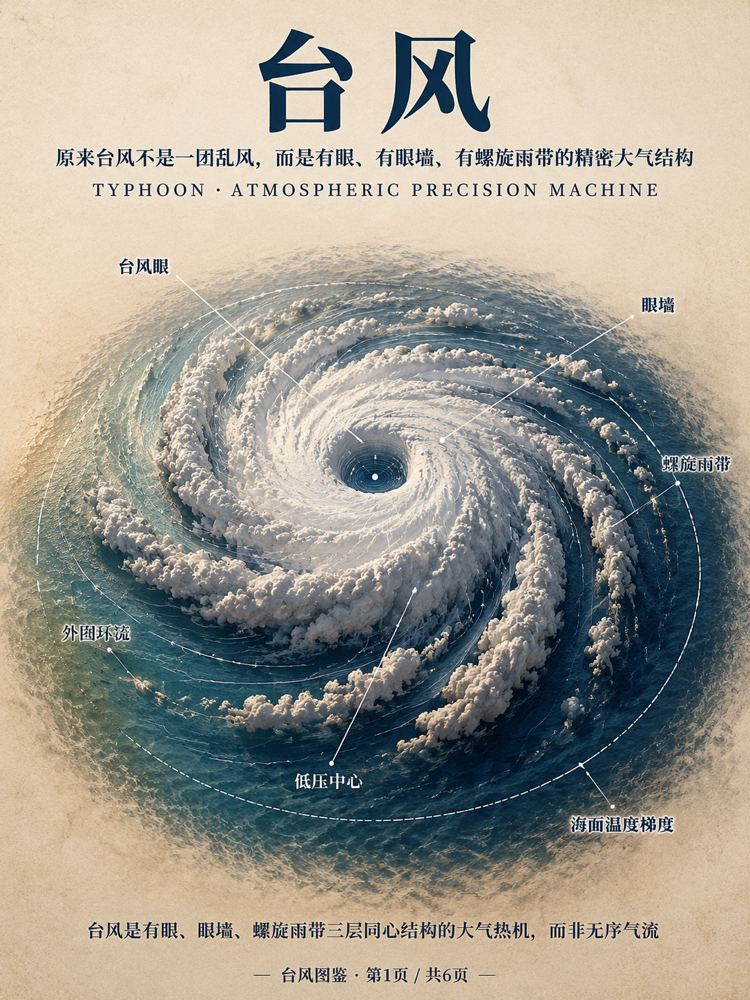
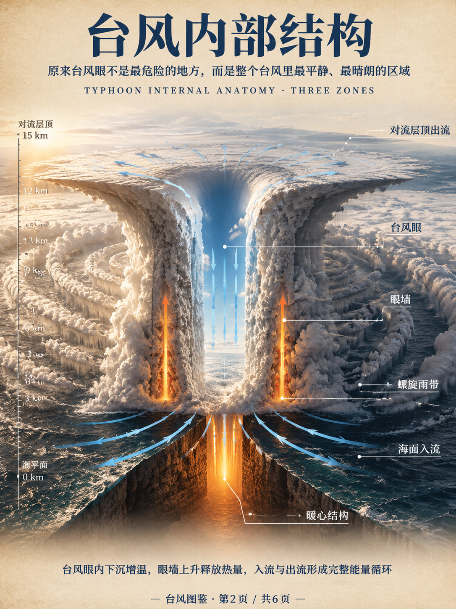
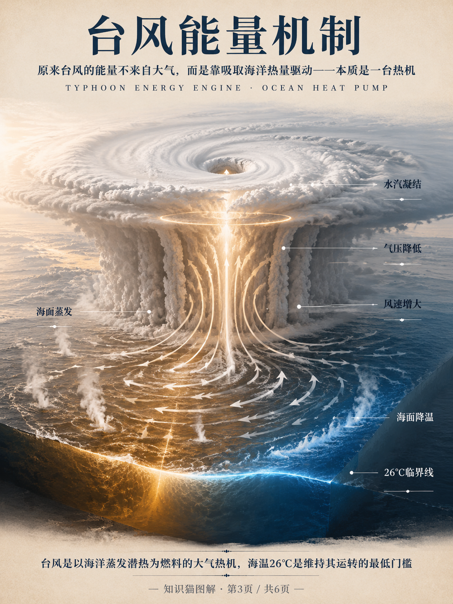
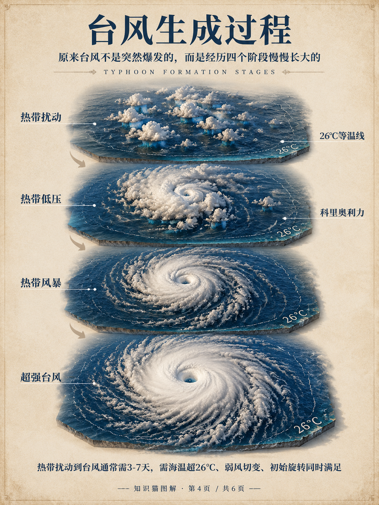
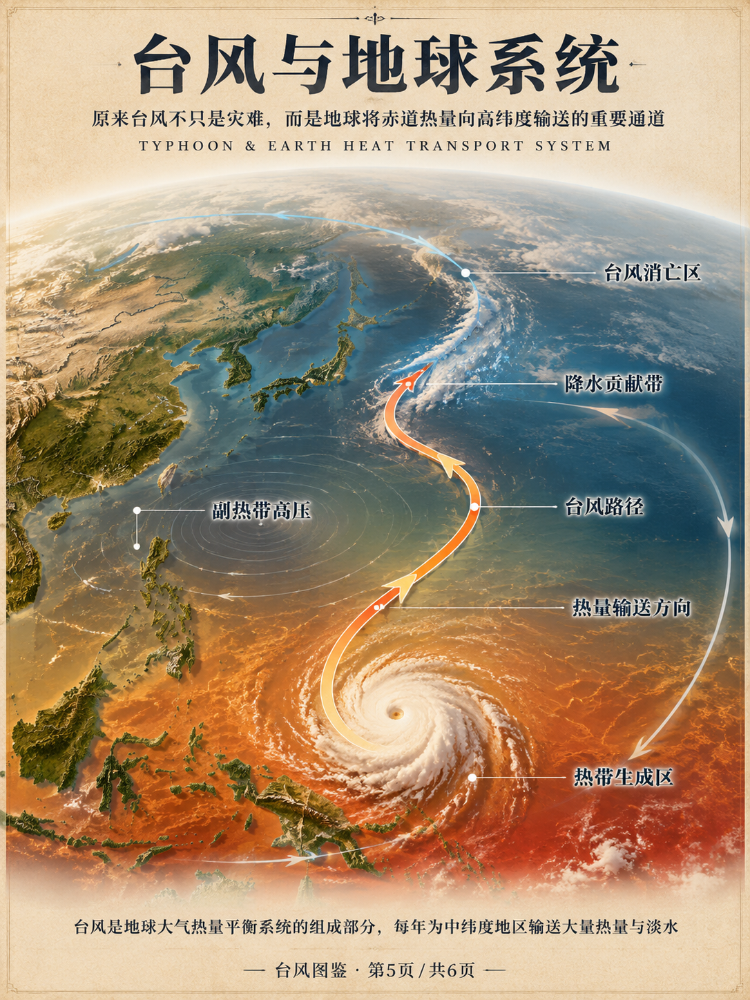
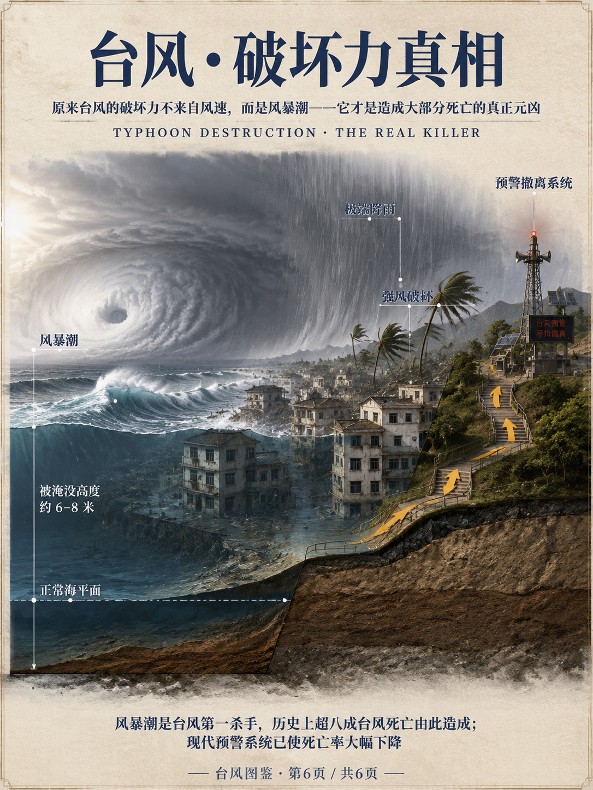

台风来了，你第一反应是什么？

大多数人想到的是"大风""暴雨""危险"。但如果从宇宙视角往下看，你会发现一件令人震撼的事：台风不是一团乱风，而是一台结构极其精密的大气热机。

今天6张图，彻底颠覆你对台风的认知。

---

从卫星俯视台风，你会看到一个完美的漩涡——中心是一个圆形的空洞（台风眼），外圈是一道厚实的云墙（眼墙），再往外是螺旋状的雨带向四周延伸。

这不是随机形成的，而是大气物理规律在热带洋面上精确运作的结果。台风从来不是"乱"的，它有非常清晰的三层同心结构，每层都有截然不同的天气状态。

---

很多人以为台风眼是最危险的地方，恰恰相反——眼内气流下沉，云消雨散，甚至会出现蓝天。

危险藏在眼墙：这里集中了台风最剧烈的上升气流、最大的风速和最强的降雨。台风登陆时，人们会先被眼墙的狂风暴雨袭击，然后经历短暂的"台风眼平静"，再被另一侧眼墙再次袭击——这种"先打、平静、再打"的节奏，是造成大量伤亡的重要原因。

---

台风的能量从哪里来？答案是海洋。

台风是一台热机：以海面蒸发的水汽为燃料，水汽上升凝结时释放的巨量潜热来驱动风和降水。海面温度超过26°C是台风维持的最低门槛——低于这个温度，燃料断供，台风自然减弱。

一个成熟台风每天释放的能量，相当于全人类发电量的200倍。而全球变暖使海洋持续升温，这正是近年来超强台风越来越频繁的根本原因。

---

台风不是突然"爆发"的，而是慢慢"长大"的。

从热带扰动（一团散乱的对流云）开始，需要经历热带低压→热带风暴→台风，整个过程通常需要3-7天。有三个条件缺一不可：海面温度超过26°C，风向随高度变化不大（弱垂直风切变），以及地球自转带来的科里奥利力——这也是为什么台风只在南北纬5°以上的洋面形成，赤道附近永远不会有台风。

---

台风不只是灾难，它还是地球"散热系统"的一部分。

热带洋面积累的大量热量，需要被输送到中高纬度地区，维持地球的热量平衡。台风正是这个输送过程的主要载体之一。广东、福建、浙江等省份约20%-30%的年降水，都来自台风带来的雨水。干旱年份台风偏少，这些地区往往同时面临用水紧张——台风的存在，对中国东南沿海的淡水补充有着不可忽视的意义。

---

最后一个颠覆认知：台风里真正的杀手不是风，而是风暴潮。

台风中心气压极低，加上强风将海水"堆积"推向海岸，登陆时海面可比正常高出3-9米，沿海低洼地区在数小时内被海水吞没。历史上超过80%的台风死亡事件，都是由风暴潮造成的。

但好消息是：现代气象科技几乎彻底改变了这一局面。1970年代一次台风可造成数万人死亡，而近十年中国大陆每次台风的死亡人数已普遍降至个位数。原因只有一个：精准预报+强制撤离。这是科技真正拯救生命的样本。

---

💡 **6张图核心结论**：台风是有精密三层结构的大气热机，由海洋热量驱动；台风眼反而最平静；风暴潮才是最大杀手；现代预警让死亡率降低了99%以上。

看完这6张图，你最感到震撼的是哪一个"原来如此"？评论告诉我👇

> 下期预告：**珊瑚礁**——原来它不是岩石，而是数百万只小动物建造的城市
