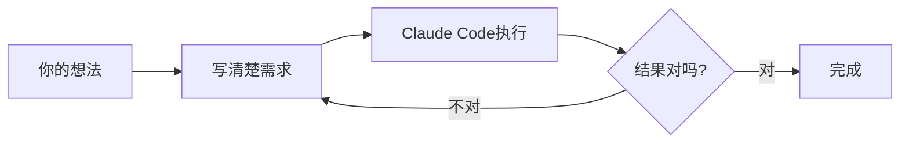

# 文章配图设计与生产指南

> 适用范围：《人人都能用AI写程序》系列教程，以及所有营销软文
> 技能来源：figure-prompt-builder + visual-explanation + openai-image-gen
> 目标：每篇文章配套 1张封面图 + 2-4张说明图，提升阅读体验和传播力

---

## 一、配图设计原则（来自 visual-explanation 技能）

### 核心哲学

> "好的配图对复杂度的作用，就像好的开头对文章的作用：压缩认知负担。"

**配图不是装饰，是压缩工具。** 只在图能比文字更高效传递信息时才加图，否则不加。

### 三层递进结构

每张说明图按以下层次设计：

| 层次 | 作用 | 要求 |
|------|------|------|
| **第一层：核心观点** | 不看标签就能理解主要意思 | 一眼抓住，无需解释 |
| **第二层：机制关系** | 带标签，展示各部分的关系 | 标签简洁，关系清晰 |
| **第三层：边界说明** | 指出简化模型失效的地方 | 可选，复杂概念才需要 |

### 概念类型 → 图表类型对照表

| 要表达的内容 | 推荐图表类型 | 示例 |
|------------|------------|------|
| 流程/步骤 | 流程图（含决策节点） | "AI编程工作流" |
| 层级/分类 | 树状结构（带层级标注） | "AI工具分类" |
| 对比/权衡 | 2×2矩阵（带坐标轴标注） | "工具选择矩阵" |
| 因果关系 | 有向图 | "需求→代码→结果" |
| 组成结构 | 嵌套圆或堆叠条形 | "AI编程能力构成" |
| 时间变化 | 时间线或阶段图 | "30天学习路径" |
| 程度/光谱 | 坐标轴+标注端点 | "工具难易程度" |

---

## 二、每篇文章需要哪些图

### 固定配图清单

**① 封面图（必须）**
- 尺寸：1200×630px（公众号/小红书通用）
- 内容：文章核心主题的视觉呈现，必须有大字标题
- 风格：扁平插画风，主色调统一（品牌色）
- 要求：不放密集文字，1个视觉焦点，留足文字覆盖空间

**② 核心概念图（1-2张）**
- 用于解释文章最重要的1-2个概念
- 优先用流程图或对比图
- 尺寸：800×500px

**③ 操作步骤截图（有操作内容时必须）**
- 每个关键步骤1张截图
- 截图需要标注箭头/圈出关键位置
- 工具：截图后用 Canva / ScreenPen 标注

**④ 数据对比图（C类省钱文章专用）**
- 展示成本对比、节省金额
- 用条形图或简单表格图
- 数字要大，结论要突出

---

## 三、图片生成方式（三个路径）

### 路径A：AI直接生成（封面图/概念插画）

**适用**：封面图、抽象概念图、场景插画

**工具推荐**：
- **GPT-image-1**（OpenAI）：插画风格好，中文提示词支持好
- **Gemini 3 Pro Image**（谷歌）：免费，适合快速出图
- **Midjourney**：质量最高，但需要英文提示词，有订阅费

**调用方式（GPT-image-1，通过LLM-Link中转）**：
```bash
# 通过 OpenAI Images API，baseUrl 指向 LLM-Link
curl https://www.llm-link.top/v1/images/generations \
  -H "Authorization: Bearer YOUR_TOKEN" \
  -H "Content-Type: application/json" \
  -d '{
    "model": "gpt-image-1",
    "prompt": "YOUR_PROMPT",
    "size": "1536x1024",
    "quality": "high"
  }'
```

---

### 路径B：代码生成图表（流程图/数据图）

**适用**：流程图、对比图、数据可视化

**工具推荐**：
- **Mermaid**（文本转图表，免费）：适合流程图、时序图
- **Matplotlib/Seaborn**（Python）：适合数据图表
- **draw.io**（在线，免费）：适合手动调整的架构图

**Mermaid 示例**（直接在 Markdown 里渲染）：
````markdown

````

---

### 路径C：Canva/模板工具（小红书封面/卡片）

**适用**：小红书封面、要点卡片、数据展示卡

**工具**：Canva（免费版够用）

**固定模板规范**（保持品牌一致性）：
- 主色：深蓝 `#1a3a5c` + 亮橙 `#ff6b35`
- 字体：标题用思源黑体Bold，正文用思源宋体
- 封面必须有：标题大字 + 系列标签 + 底部品牌标识

---

## 四、图片提示词框架（来自 figure-prompt-builder 技能）

### 提示词必须包含的6个要素

```
[图表类型] + [读者应该得到什么结论] + 
[布局/元素] + [视觉风格] + [配色] + [输出要求]
```

### 封面图提示词模板

```
扁平插画风格的文章封面图，1200x630px横版。

主题：[文章核心主题，一句话描述]
画面构成：[主要视觉元素，2-3个，具体描述]
视觉焦点：画面中央或左侧2/3区域
右侧1/3留白：用于叠加文字标题

配色方案：深蓝(#1a3a5c)为背景，橙色(#ff6b35)为强调色，白色为辅助
风格要求：简洁现代，无过多装饰，图标化元素
不要出现：密集文字、真实人脸、复杂背景
输出格式：PNG，高清
```

### 概念说明图提示词模板

```
简洁的信息图表，800x500px。

要表达的核心观点：[一句话说清楚图要传达什么]
图表类型：[流程图/对比图/关系图/层级图]
必须包含的元素：[列出3-5个关键元素/节点]
关系说明：[元素之间的关系，用箭头/颜色区分]

风格：白色背景，线条清晰，节点用圆角矩形
配色：主色深蓝，强调色橙色，文字深灰
字体：中文，清晰可读，关键词加粗
不要：3D效果、阴影、过度装饰
```

---

## 五、系列教程每篇配图规划

### 第01篇：AI编程是什么

| 图片 | 类型 | 内容描述 | 生产路径 |
|------|------|---------|---------|
| 封面图 | AI生成 | 一个普通人坐在电脑前，旁边有AI助手图标，表情轻松愉快 | 路径A |
| 概念图1 | Mermaid | "你 → 需求描述 → Claude Code → 程序" 流程图 | 路径B |
| 对比图 | Canva | 传统编程 vs AI编程的对比（时间/门槛/结果） | 路径C |

**封面图完整提示词**：
```
扁平插画风格，1200x630px横版。

主题：普通人用AI写程序，轻松愉快的氛围
画面构成：
  - 左侧：一个简约风格的人物坐在笔记本电脑前，表情放松
  - 中间：屏幕上显示聊天对话框，有AI回复的代码
  - 右侧：飘浮的代码符号和齿轮图标，表示程序在运行

视觉焦点：人物和电脑屏幕
右侧上方1/4留白用于文字叠加

配色：深蓝(#1a3a5c)背景，橙色(#ff6b35)高亮，白色人物和元素
风格：简洁扁平，无阴影，图标化
不要：真实人脸、密集文字、复杂背景
```

---

### 第02篇：需求描述能力

| 图片 | 类型 | 内容描述 | 生产路径 |
|------|------|---------|---------|
| 封面图 | AI生成 | 语言/文字转化为代码的视觉隐喻 | 路径A |
| 对比图 | Canva | 好需求 vs 坏需求的卡片对比 | 路径C |
| 框架图 | Mermaid | 需求描述四步框架流程图 | 路径B |

---

### 第04篇：Claude Code安装教程

| 图片 | 类型 | 内容描述 | 生产路径 |
|------|------|---------|---------|
| 封面图 | AI生成 | 工具安装/启动的视觉表达 | 路径A |
| 步骤截图 | 截图标注 | 每个安装步骤的截图（6-8张） | 路径C标注工具 |
| 成功截图 | 截图标注 | Claude Code成功运行的终端截图 | 截图 |

---

## 六、生产 SOP（每篇文章配图流程）

```
写完文章草稿
    ↓
确定需要几张图（封面必须，其他按需）
    ↓
按上方规划表，写好每张图的提示词
    ↓
路径A（AI生成）：调用图片API，生成3-5个版本，选最好的
路径B（代码生成）：写Mermaid/Python代码，渲染导出PNG
路径C（Canva）：套模板，替换文字和数据
    ↓
所有图统一压缩（< 500KB/张）
    ↓
按文章顺序插入，检查图文对应关系
    ↓
发布前最终检查：封面图是否有标题文字覆盖区域
```

---

## 七、快速参考：诊断图表选型

遇到不确定用什么图时，问自己三个问题：

1. **"如果画在纸上，会是什么形状？"** → 描述出来，通常能定出图表类型
2. **"这张图的核心变量是什么？"** → 单变量→时间线，双变量→矩阵，多变量→流程图
3. **"一句话能概括图要表达什么吗？"** → 不能的话，说明需要拆成两张图
