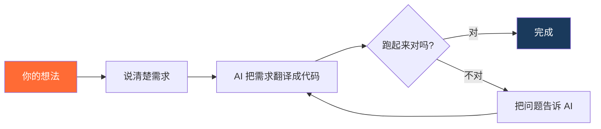

# 第01篇：不会写代码，也能做出自己的程序吗？

> 系列：《人人都能用AI写程序》第一章·认知篇 · 第1/14篇
> 适合读者：完全零基础，对编程好奇但不知从何开始的普通人
> 阅读时间：约 13 分钟

---

<!-- IMAGE:01 type=cover prompt-ref=images/prompts.md#cover -->

先说说我为什么写这个系列。

我们技术团队很早就开始全员用 AI 写程序，中间踩了非常多的坑。后来我冒出一个念头：随着 AI 越来越强，能不能让完全不懂计算机的人，也轻松上手做出自己的工具？

于是我做了个实验——教几个非技术岗的同事（有做运营的、有做行政的）用 AI 写程序。结果出乎意料：他们真的做出来了。有人做了自动整理表格的脚本，有人画出了产品原型。

那一刻我确定：**是时候把这套方法，系统地讲给每一个普通人听了。**

而一组数据更能说明问题——**Replit（全球最大的在线编程平台）公布：75% 的用户在做出程序时，从来没有手写过一行代码。**

如果你也曾觉得"编程是程序员的事，跟我没关系"，这个系列会改变你的看法。读完这一篇，你脑子里会冒出一个新问题：**我手头那件天天发愁的麻烦事，是不是也能让 AI 做成一个小工具？**

---

## 这个系列适合谁

先帮你对号入座：

- **完全零基础的纯小白**：想用 AI 做工具或小产品，但不知道从哪开始
- **会用电脑就够**：能正常用 Windows / Mac，会装软件、会日常办公，就行
- **产品 / 运营 / 自由职业者**：有想法，想自己动手，不想总排队等开发
- **想用 AI 提效、甚至做副业的人**

如果你是上面任何一种，跟着这个系列一步步走，你能做出自己的第一个真实可用的小工具。

---

## 先讲清楚：这个系列教什么，不教什么

**不教**：编程语法、背 API、刷算法题——这些是给职业程序员的。

**教**：怎么用 AI 把你的想法变成能跑的程序，同时建立一套"够用的技术常识"。

为什么强调"常识"？因为有个误区要先破除：很多人以为"用 AI 编程 = 什么都不用懂"。

不对。你确实不用写代码，但你需要一张**地图级的常识**：程序到底跑在哪、一个软件由哪几部分组成、为什么会报错、钱花在什么地方。这张地图不深，半小时能建立，但不能没有——**它决定了你能不能听懂 AI 在干什么，能不能在它跑偏时把它拉回来。**

这正是这个系列和"网上随便一篇 AI 教程"的区别：我们不只教你抄提示词，还帮你建立真正的理解。

---

## 你以为的编程，和现在的编程

先说一个你可能有的印象：编程 = 对着黑屏敲一行行看不懂的字符，得学几年才能入门。

这个印象，放在 2020 年之前是对的。

但现在出现了一种全新的方式，叫 **Vibe Coding（氛围编程）**——你用中文描述你想要什么，AI 把它翻译成程序。

这不是噱头。2025 年，"Vibe Coding"被柯林斯词典选为年度词汇。Y Combinator（全球最顶级的创业孵化器）最新一批创业公司里，有 **25% 的团队说他们 95% 的代码都是 AI 写的**。

这背后是**角色的彻底反转**：过去是人写代码、电脑执行；现在是**你负责想，AI 负责写，电脑执行**。

对你意味着什么？意味着你不用等三年学完计算机课，**这个月**你就能做出一个能用的小工具。

---

## 一个类比：你和 AI 是什么关系

想象你要从北京开车去上海。

**传统编程**是：你得先考驾照、学手动挡、搞懂每条路况，然后自己开过去。

**AI 编程**是：你坐在副驾驶，旁边有个 24 小时不睡、熟悉每条路的老司机。你告诉他"我要去上海，顺路经过南京，别走高速"，他就开过去了。

你不需要会开车，但你得知道自己要去哪。

这就是 AI 编程的本质：**你负责目的地和方向，AI 负责驾驶和执行。**

但注意——"不需要会开车"不等于"可以睡觉"。你得看着窗外判断方向对不对，在它走错时喊停，到了之后确认这是不是你要的地方。**你是甲方，不是乘客。**

<!-- IMAGE:02 type=mermaid -->



---

## 理论一：AI 为什么"会写代码"

不用懂技术细节，但有三个常识你得知道，否则用起来一头雾水。

**第一，代码只是"给电脑的说明书"。**

电脑很笨，它只会严格照着指令一步步执行。所谓"程序"，就是一份写给电脑的、极其精确的说明书。过去这份说明书得人来手写，现在 AI 替你写——因为它"读"过海量的代码，知道这类说明书长什么样。

**第二，AI 写代码靠的是"见得多"，不是"真的懂"。**

AI 把全世界公开的代码都学了一遍，掌握了"遇到这种需求，通常这样写"的规律。所以它对常见的、有大量先例的需求（读文件、做表格、搭网页）特别在行；对又新又怪、没什么先例的需求，它就容易"自信地瞎编"。这也解释了为什么——**从小而常见的需求开始，成功率最高。**

**第三，你和 AI 之间靠"自然语言"沟通。**

这是这几年最大的变化。以前你得用编程语言跟电脑对话，现在你用中文跟 AI 说，AI 再翻译成代码。**所以你的中文表达能力，直接决定结果好坏**——这正是下一篇要专门训练的事。

记住这三条就够了。似懂非懂很正常，是慢慢消化的过程。

---

## 理论二：一个程序，到底由哪几部分组成

这是最该建立的一张"地图"。几乎所有软件——你刷的 App、逛的网站、用的小程序——都由三大块组成：**前端、后端、数据库。**

光说名词太抽象，我们用**寄快递**这件事来类比，一次讲透：

<!-- IMAGE:03 type=infographic path=images/03-architecture.png -->


把这三个角色对上号，你就理解了几乎所有软件的骨架：

> **前端**是脸面，**后端**是大脑，**数据库**是记忆。

你做一个记账工具——填账目的界面是前端，算总和的逻辑是后端，存下每一笔账的是数据库。
你做一个客户管理系统——查询页面是前端，匹配筛选是后端，客户资料库是数据库。

**似懂非懂也没关系**，不用深究细节。有了这张地图，后面 AI 跟你说"我先写前端"或"数据要存到数据库"时，你就知道它在做哪一块了。

---

## 理论三：那么多 AI 编程工具，到底用哪个

市面上 AI 编程工具一大把，新手很容易挑花眼。我直接给你结论和理由。

<!-- IMAGE:04 type=concept prompt-ref=images/prompts.md#tools -->

| 工具 | 特点 | 适合 |
|------|------|------|
| **Claude Code** | 目前综合能力最强之一，尤其擅长理解复杂需求、写大项目 | 本系列主推 |
| Codex | OpenAI 出品，质量高 | 备选 |
| Kimi / GLM / MiniMax | 国产，访问方便、价格友好 | 国内备选 |

**本系列以 Claude Code 为主线**，原因是它对零基础最友好：你用大白话说需求，它能自己规划、自己写、自己改。

但有个现实问题：Claude Code 在国内直接用，会遇到网络访问和付费的障碍。**我们的解决办法是通过 LLM-Link 中转**——它帮你打通访问、统一管理多个模型、还能按量付费省钱。这个后面装环境时会手把手教，现在你只要知道"有这么个省心的方案"就行。

**记住一句话：工具会变，方法论不变。** 你学的是"怎么和 AI 协作把事做成"，这套本事换任何工具都通用。

---

## 那么，你具体能做什么？

理论铺垫完，来看真实的。直接说三个发生在我们身边的案例：

**案例 1：HR 做了简历自动筛选工具**

一位完全没有编程背景的招聘负责人，告诉 AI：把文件夹里的简历 PDF 批量读取，按职位关键词打分、排序、输出 Excel。AI 帮她做出来了。她现在每次招聘省 2 小时。

**案例 2：美甲店老板做了客户管理系统**

想记录每个客户的服务历史、偏好和联系方式，普通表格太乱。用 AI 做了一个小网页，手机就能查，从提需求到能用，3 小时。

**案例 3：自媒体人做了竞品监控脚本**

做小红书内容的博主，想每天自动收集竞品账号的更新数据存进表格。AI 写了一个定时运行的脚本，从此不用手动统计。

**这三个人的共同点**：没写过代码，但他们都能清楚说出"我想要什么"。

---

## 你唯一需要学的能力

看完三个案例，你会发现一件事：**能不能做成，关键在于需求说得清不清楚。**

看这两种说法的差距：

> ❌ 差的需求："帮我做一个记账软件。"

> ✅ 好的需求："帮我做一个记账工具，只要两个功能：添加一笔收支记录（要有日期、金额、类型、备注），以及查看本月所有记录和合计金额。数据存在本地文件里，不需要联网，在命令行里用就行。"

同样是"记账软件"，后者让 AI 清楚知道：做什么、有哪些功能、数据怎么存、什么形式。结果差距是巨大的。

**这个能力叫需求描述**，它不需要任何技术背景，但需要练习。下一篇专门讲怎么训练，还会给你一个能直接套用的四步框架。

---

## AI 的边界：先把丑话说在前面

说了能做什么，也必须说清楚做不到什么——这样你才不会被坑。

<!-- IMAGE:05 type=concept prompt-ref=images/prompts.md#boundary -->

**AI 擅长的：**

- 把清晰的需求变成可运行的代码
- 修复已知类型的错误
- 在有明确参考的情况下实现功能

**AI 会犯错的地方：**

- 需求不清晰时，它会"自由发挥"，结果可能完全不是你要的
- 它有时"自信地犯错"——代码看起来完整，但逻辑有漏洞
- 项目越复杂，它越需要你持续介入和引导

**正确姿势**：把 AI 当一个能力很强但需要明确指令的执行者，而不是"说个大概就能搞定一切"的魔法工具。这一点很重要，第 03 篇会专门讲怎么当好这个"产品经理"。

---

## 小试牛刀：5 分钟跑出你的第一个作品

讲了这么多，不如亲手做一个。哪怕你现在还没装任何工具，也先把这件事**记在心里**——下一章装好工具后，第一件事就干这个。

打开 AI 编程工具的对话框，**原样复制**这段话发给它：

```
请使用 html（index.html）帮我生成一个烟花动效的页面，
五秒钟之后出现：
主标题："hello world"
副标题："恭喜你完成了第一个 AI 编程的网页"
```

你发出去之后，AI 大概是这样回应你的——逐字打出回复，几秒钟就把页面写好：

<!-- IMAGE:05 type=gif path=images/05-demo-aichat.gif -->


然后用浏览器打开它生成的 index.html，你会看到满屏烟花，加上你的专属文字：

<!-- IMAGE:06 type=gif path=images/06-demo-firework.gif -->


**这就是你的第一个 Vibe Coding 作品。** 你没写一行代码，但它真的跑起来了。

> 还没装工具？先收藏本文。下一章《准备篇》会手把手教你 10 分钟装好 Claude Code，然后我们就来跑这个烟花页面。

---

## 三个你可能担心的问题

**Q1：AI 写的代码出错了，我看不懂怎么修？**

你不需要看懂代码。把报错信息直接粘给 AI，它会自己修。你要做的只有一件：判断"程序有没有按我要的方式运行"。跟你用一个 App 的感觉完全一样——不用懂底层，能判断好不好用就行。

**Q2：我的需求太简单了，没什么意义。**

简单的需求反而更适合开始。AI 对"帮我记录今天喝了几杯水"这种小需求的完成质量，比"做一个健康管理系统"稳定得多。从小处开始，是正确策略，不是能力不足。

**Q3：这个技能会不会很快过时？**

工具会一直升级，但有件事不会过时：**把模糊的想法变成清晰的需求**。这是人的能力，AI 替不了。而且随着 AI 越来越强，懂得和它协作的人，能做到的事只会越来越多。

---

## 本篇小结

三句话，可以截图保存：

1. **门槛变了，不是消失了**——不再需要学代码，但要学会说清需求、建立够用的技术常识
2. **你是决策者，AI 是执行者**——方向和判断归你，实现归 AI
3. **记住一张地图**——前端是脸面、后端是大脑、数据库是记忆

---

## 下一篇预告

你现在有了方向，也有了基本的技术地图。但实操时，大多数人卡在同一处：**不知道怎么把想法变成 AI 听得懂的指令。**

下一篇专门讲这件事——给你一个**需求描述四步框架**，附大量好/坏案例对比。读完之后，你写给 AI 的每段描述都会质量翻倍。

> 👉 **《第02篇：你的想法值多少钱——需求描述才是核心能力》**

---

**留个作业给你**

你现在最想用 AI 做的一个小工具是什么？哪怕只是"帮我把微信收藏的链接批量整理成 Excel"这种都行。

**评论区留言告诉我**——下一篇的实战案例，我会从评论里选 3 个真实需求，演示完整的需求描述过程。

---

*《人人都能用 AI 写程序》系列每周二、周五更新，跟着一步步来，下节见。*
*留言私信 → 进群一起练手 [群二维码]*

