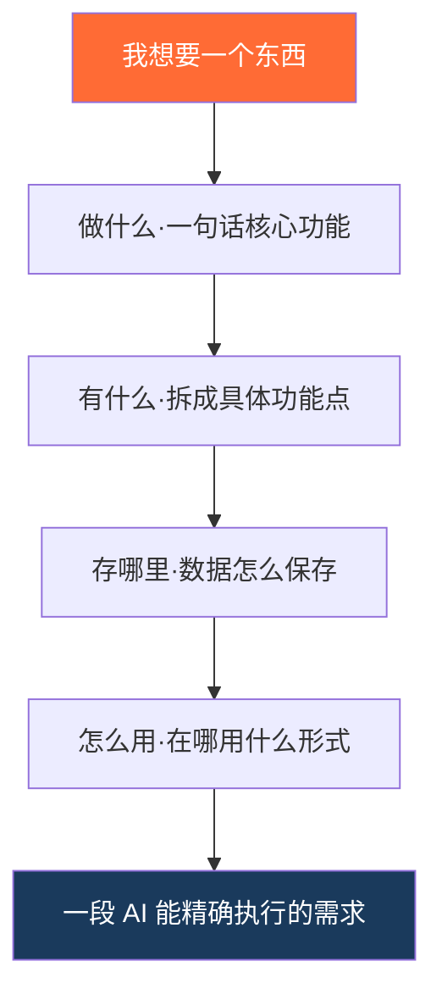

# 第02篇：你的想法值多少钱——需求描述才是核心能力

> 系列：《人人都能用AI写程序》第一章·认知篇 · 第2/14篇
> 适合读者：完全零基础，刚知道 AI 能帮自己写程序的普通人
> 阅读时间：约 11 分钟

---

<!-- IMAGE:01 type=cover prompt-ref=images/prompts.md#cover -->

上一篇结尾，我留了个作业：用一句话说出你最想让 AI 做的小工具。

评论区很热闹，但有一条留言特别典型。一位做电商运营的读者发来：

> "帮我做个管理软件。"

然后他私信问我：我照着你说的发给 AI 了，为什么它给我的东西，完全不是我想要的？

我没直接回答，反问了他一句：

**"如果你把'帮我做个管理软件'这句话，发给一个刚入职的真人助理，他能猜到你到底要什么吗？"**

他愣了几秒，回我：……好像确实不能。

这就是今天要讲的事，也是整个系列里**最值钱的一课**——

在 AI 编程里，**你的代码质量，约等于你的需求质量**。想法人人都有，但能把想法说清楚的人，少之又少。而这恰恰是唯一一件 AI 替不了你、必须你自己练的本事。

这一篇，我就带你把"我想要个东西"，变成 AI 能精确执行的指令。

---

## 先接上一篇：为什么 AI 听不懂"大概意思"

上一篇我们讲过一个原理：**AI 写代码靠的是"见得多"，靠的是你用自然语言给它的指令。** 这两点，正是理解今天这件事的钥匙。

你说"做个管理软件"时，你脑子里其实是有画面的——管什么？客户还是库存？要不要查询？数据存哪？你心里都有数。

但问题是：**这些画面在你脑子里，没在你说出口的那句话里。**

AI 不会读心。它接收到的，只有"管理软件"这四个字。剩下的全部细节，它只能靠"猜"——根据它见过的几百万个"管理软件"去猜一个最常见的。而那个最常见的，十有八九不是你心里那个。

打个比方你就懂了：

<!-- IMAGE:02 type=infographic path=images/02-mindgap.png -->

你脑子里的想法是一座冰山，露出水面、说出口的，只有顶上那一角。AI 只能看到水面上的一角，水面下那 80% 它看不见，只能脑补。

**所以问题从来不在 AI 笨，而在于：你以为你说清楚了，其实只说出了 20%。**

那剩下的 80% 怎么捞出来、说明白？别急，有方法，而且不难。

---

## 插一个你迟早会撞上的词：AI 幻觉

这里得先科普一个术语，因为你以后天天会遇到它——**AI 幻觉（Hallucination）**。

意思是：当信息不足时，AI 不会说"我不知道"，而是会**一本正经地编一个看起来很合理、其实是错的答案**。你需求里没说清的那 80%，它就靠"幻觉"给你补全——补出来的，自然多半不是你要的。

有句话总结得特别精辟：**"AI 的自信，远远超过它的可靠性。"**

它给你的东西永远是信心满满、完整流畅的，哪怕全是瞎编。这不是 bug，是它的工作方式决定的（上一篇讲过：它在"接龙"最像答案的东西，不是"检索"正确答案）。

**而对付幻觉最有效的武器，不是更聪明的 AI，是更清晰的需求。** 你把那 80% 主动说清楚，AI 就没有"发挥"的空间，幻觉自然就少了。这就是为什么需求描述是核心能力——它直接决定了 AI 会不会跑偏。

---

## 需求描述四步框架：做、有、存、用

说清楚需求不需要天赋，只需要一个固定顺序。记住四个字：**做、有、存、用**。

照着这四步填空，你脑子里那座冰山，就能完整地搬到 AI 面前。

<!-- IMAGE:03 type=mermaid -->

我们就拿那位运营读者的"管理软件"，一步步把它救活。

### 第一步：做什么——一句话说清核心功能

先用一句话说清：这东西到底解决你哪个具体问题。

- ❌ "做个工具帮我管理"
- ✅ "做个工具，帮我记录每天每个客户的跟进情况"

**为什么重要**：这一步是给 AI 定方向。方向错了，后面全错。而且有个隐藏好处——**一句话说不清，说明你自己都还没想明白**，这时候先别急着发给 AI，先把自己想清楚。

那位运营读者卡的就是这一步。我让他别说"管理软件"，说说他每天最烦的那件事。他想了想："我每天要跟几十个客户，老忘了谁该回访了。" ——你看，需求一下就具体了。

### 第二步：有什么——拆成具体的功能点

把"做什么"拆成几个能动手的小动作。

- ❌ "功能要全一点"
- ✅ "两个功能就够：①添加一条客户跟进记录 ②列出今天该回访的客户"

**关键技巧，记牢：宁可少，不要全。** 这是新手最大的坑——总想"一步到位、功能全一点"，结果 AI 给你堆一大坨用不上的功能，又复杂又容易出 bug。

**为什么**：上一篇讲过，AI 对小而清晰的需求完成度最高。功能拆得越小越具体，AI 做得越准，你也越容易验收。先把最核心的两三个功能跑通，尝到甜头，再慢慢加——这才是正路。

### 第三步：存哪里——数据要不要留下来

你的数据，关掉程序还要不要在？

- ❌ （完全不提 → AI 默认不存，关掉就全没了）
- ✅ "记录存在本地一个文件里，下次打开还在，不用联网"

**为什么这步最容易被忘、又最致命**：它直接决定你做出来的是"一次性玩具"还是"能天天用的工具"。那位运营读者一开始没提这点，AI 做的版本一关就清空——等于白做。加上这句话之后，他的客户记录才真正存住了。

### 第四步：怎么用——在哪用、长什么样

你打算在什么地方、以什么形式用它？

- ❌ （不提 → AI 随便给你个形式，可能是你打不开的）
- ✅ "在电脑上用就行，先做成最简单的命令行工具，不用做网页"

**为什么**：形式越简单，AI 做得越快越稳，你也越快能看到成果。**别一上来就要"做成精美网页/手机 App"**——那是给自己加难度。先用最朴素的形式把功能跑通，等好用了，下一章我们再教你给它穿上漂亮界面。

---

## 把四步拼起来：见证一句话的蜕变

现在，把那位运营读者的需求用四步框架重写一遍，对比一下前后：

**改造前**（他最开始发的）：

> 帮我做个管理软件。

**改造后**（用"做、有、存、用"填完）：

> 帮我做一个客户跟进小工具。
> **【做什么】** 帮我记录每天每个客户的跟进情况，提醒我谁该回访了。
> **【有什么】** 两个功能：①添加一条跟进记录（客户名、跟进内容、下次回访日期）；②列出今天和之前该回访、但还没跟进的客户。
> **【存哪里】** 记录存在本地文件里，下次打开还在，不用联网。
> **【怎么用】** 在电脑上用，先做成简单的命令行工具，不用做网页。

同一个人、同一个想法，两句话发给 AI，结果是两个世界：

- **改造前**：AI 反复猜、反复改，五轮下来还不是他要的，他差点放弃。
- **改造后**：AI 一次就给出一个能用的工具。

下面这张动图，是两种需求发给 AI 后的真实对话对比——左边模糊需求改到崩溃，右边清晰需求一次到位：

<!-- IMAGE:05 type=gif path=images/05-compare.gif -->

---

## 成果：这段需求真能跑出东西

这不是纸上谈兵。把上面那段四步需求发给 AI，几分钟后就得到一个真能用的客户跟进工具。下面是它在终端里运行的真实样子：

<!-- IMAGE:04 type=screenshot path=images/04-demo-crm.png -->

加了几条客户记录，它自动列出"今天该回访"的人，一目了然。数据存在本地，关掉再打开还在。

**那位运营读者全程没写一行代码，只是把一句话，改成了四句话。** 这就是需求描述的全部威力。

> 现在还没装工具也没关系，先把这段需求模板收藏。下一章装好 Claude Code，第一件事就是把它跑出来。

---

## 一个反直觉的真相：写需求，是在帮你自己想清楚

你可能觉得：描述得这么细，是不是太麻烦了？随便说说让 AI 猜，不香吗？

恰恰相反。**前期多花 3 分钟说清楚，后期省 30 分钟的来回返工。** 这笔账怎么算都划算。

但更深一层的价值在这里：**写需求的过程，本质是逼你自己把模糊的想法想清楚。**

很多人做不出东西，根本不是不会用 AI，而是——他自己压根没想明白要做什么。"做个管理软件"之所以失败，不是 AI 不行，是他心里那座冰山，从来没被自己看清过。四步框架真正的作用，是给你一把铲子，把水面下的 80% 一点点挖出来。

所以记住这句话：**需求描述这件事，AI 永远替不了你——因为只有你知道，你到底要去哪。** 这也是为什么我说，这是整个系列最值钱的一课。

---

## 方法论沉淀：需求颗粒度选择矩阵

讲了这么多，我把它浓缩成一张可以一直用的图。两个维度——**功能多少**（纵轴）和**描述清晰度**（横轴）——把需求分成四个象限：

<!-- IMAGE:06 type=infographic path=images/06-matrix.png -->

- **又多又模糊**（左上）："做个功能全的管理系统" → AI 必翻车，新手坟墓
- **少而模糊**（左下）："做个简单小工具" → 看着简单，其实还是没说清
- **多而清晰**（右上）：一口气十个清晰功能 → AI 容易顾此失彼，等你进阶再玩
- **又少又清晰**（右下）：**这就是你该待的象限**——2-3 个功能，用"做有存用"说透，一次到位

新手所有的失败，几乎都是因为待错了象限。**记住：往右下角走。** 先把一个小而清晰的需求跑成功，建立信心和手感，再慢慢往上加功能。

这张矩阵背后是一个更本质的道理：**需求描述的本质，是把你脑子里的"隐性知识"，翻译成 AI 能执行的"显性指令"。** 你越往右下角走，翻译得越完整，AI 的幻觉空间就越小，成功率就越高。这套思维，不只用在编程——你跟任何人、任何工具协作，都通用。

---

## 本篇小结

三句话，可以截图保存：

1. **代码质量 ≈ 需求质量**——AI 不会读心，你没说出口的，它只能靠"幻觉"瞎补
2. **四步框架：做、有、存、用**——照着填空，把脑中冰山完整搬给 AI
3. **往矩阵右下角走**——又少又清晰，是新手成功率最高的起点

---

## 下一篇预告

需求说清楚了，AI 也开始干活了。但你很快会撞见一件让新手慌神的事：**AI 一脸自信地，给了你一个错误的答案。**

下一篇讲怎么当好 AI 的"产品经理"——怎么一眼看出它错了、怎么用一句话让它改对、什么时候该信它、什么时候要留个心眼。学会这个，你才算真正会和 AI 协作。

> 👉 **《第03篇：AI 会犯错，你要学会当"产品经理"》**

---

**留个作业给你**

用今天的"做、有、存、用"四步，把你心里那个小工具的需求写出来——任何想法都行，哪怕只是"提醒我每天喝水"。

**留言发给我**，我帮你看看四步里哪一步还没说透。下一篇，我会从留言里挑几个真实需求，当场演示怎么改。

---

*《人人都能用 AI 写程序》系列每周二、周五更新，跟着一步步来，下节见。*
*留言私信 → 进群一起练手 [群二维码]*

