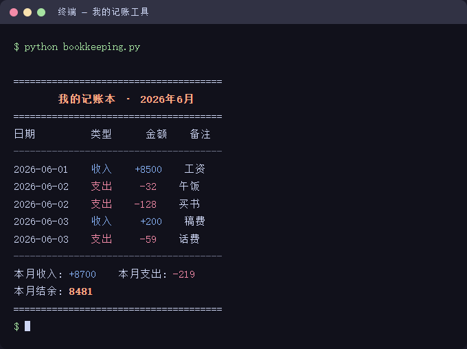

<!--
公众号版 · 第02篇
- 封面用 ../images/01-cover.png
- IMAGE:02 四步框架 mermaid 请用 mermaid.live 转 PNG 后插入
- 编辑器粘贴后把 ## / ### 转成小标题样式,正文 16px,行高 1.75
-->

# 你的想法值多少钱：需求描述才是核心能力

> 《人人都能用 AI 写程序》系列 · 第 02 篇
> 适合零基础读者 · 阅读约 8 分钟

上一篇讲完，有读者在评论里发了这么一句需求给 AI：

> "帮我做个管理软件。"

然后他问我：为什么 AI 给我的东西完全不是我想要的？

我反问他一句：**如果你把这句话发给一个真人助理，他能猜到你想要什么吗？**

他愣了一下。

这就是今天要讲的事——**在 AI 编程里，你写的代码质量，等于你描述需求的质量。** 想法人人都有，但能说清楚的人很少。

---

**为什么"说清楚"这么难**

不是你笨，是因为你脑子里的想法，比你说出来的多得多。

你说"做个记账软件"时，脑子里其实有画面：能记一笔钱、能看月底总和、最好手机能用。但这些 AI 看不到——**它只能听到你说出口的那几个字。**

AI 不会读心。你省略的每一个细节，它都得自己猜。而它猜的方向，十有八九不是你要的。

所以问题不在 AI，在于：**你以为说清楚了，其实只说了 20%。**

---

**需求描述四步框架**

别慌，说清楚需求不需要天赋，只需要一个顺序。记住四个字：**做、有、存、用。**

> 四步框架流程图：
> 我想要一个东西 → 做什么（一句话核心功能）→ 有什么（拆成具体功能点）→ 存哪里（数据怎么保存）→ 怎么用（在哪用、什么形式）→ 一段清晰的需求。

**第一步：做什么（核心功能一句话）**

先用一句话说清这东西到底解决什么问题。

- ❌ "做个工具帮我管理"
- ✅ "做个工具，帮我记录每天的收入和支出"

一句话说不清，说明你自己还没想明白，先别急着发给 AI。

**第二步：有什么（拆成具体功能点）**

把"做什么"拆成几个能动手的小功能。

- ❌ "功能要全一点"
- ✅ "两个功能就够：①添加一笔记录 ②查看本月所有记录和合计"

**关键技巧**：宁可少，不要全。新手最大的坑就是一上来要"功能全一点"，结果 AI 做出一堆你用不上的东西，还容易出错。

**第三步：存哪里（数据怎么保存）**

你的数据要不要留下来？留在哪？

- ❌ （完全不提，AI 默认关掉就没了）
- ✅ "数据存在本地一个文件里，下次打开还在，不需要联网"

这一步最容易被忘，但它决定了你的程序是"一次性玩具"还是"能长期用的工具"。

**第四步：怎么用（在哪用、什么形式）**

你打算在什么环境用它？

- ❌ （不提，AI 随便给你个形式）
- ✅ "在电脑命令行里用就行，先不用做成网页"

形式越简单，做出来越快越稳。等能用了，再升级界面也不迟。

---

**把四步拼起来，看效果**

还是那个"记账软件"，用四步框架重写一遍：

> 帮我做一个记账工具。
> **【做什么】** 帮我记录每天的收入和支出。
> **【有什么】** 两个功能：①添加一笔记录，包含日期、金额、类型（收入/支出）、备注；②查看本月所有记录和合计金额。
> **【存哪里】** 数据存在本地文件里，下次打开还在，不需要联网。
> **【怎么用】** 在电脑命令行里用就行，先不用做网页。

把这段发给 AI，和发"做个记账软件"，结果是两个世界。

**前者**：AI 一次就给你一个能用的工具。
**后者**：AI 猜来猜去，你改五轮还不对。

---

**成果：这段需求真的能跑出东西**

别以为这是纸上谈兵。把上面那段四步需求发给 AI 编程工具，几分钟后它就给你一个能用的记账工具。下面是用这段需求做出来、在终端里运行的真实效果：

加了 5 笔账，自动算出本月收入、支出、结余。数据存在本地文件里，关掉再打开还在。

**全程你没写一行代码，只写了一段说清楚的需求。** 这就是需求描述的威力。

---

**一个反直觉的真相**

你可能觉得：描述这么细，是不是太麻烦了？

恰恰相反。**前期多花 3 分钟说清楚，后期省 30 分钟来回返工。**

而且你会发现，写需求的过程，其实是逼自己想清楚到底要什么。很多人做不出东西，不是不会用 AI，是自己压根没想明白要做啥。

需求描述这件事，AI 永远替不了你——因为只有你知道你要去哪。

---

**本篇小结**

三句话，可以截图保存：

1. **代码质量 = 需求质量**，AI 不会读心，你省略的它就得猜
2. **四步框架：做、有、存、用**，照着填就能说清楚
3. **宁可少，不要全**，新手从最小功能开始最稳

---

**下一篇预告**

需求说清楚了，AI 也开始干活了。但你很快会遇到一件事：**AI 自信地给了你一个错误答案。**

下一篇讲怎么当好 AI 的"产品经理"——怎么发现它错了、怎么让它改对、什么时候该信它什么时候该怀疑它。

> 👉 《第03篇：AI 会犯错，你要学会当"产品经理"》

---

**留个作业给你**

用今天的"做、有、存、用"四步，写一段你自己的需求——任何想做的小工具都行。

**发评论区**，我帮你看看哪一步还没说清楚，下一篇挑几个真实需求来演示。

---

> 《人人都能用 AI 写程序》系列每周二、周五更新。
> 进群一起练手 → 文末扫码。下一篇见。
