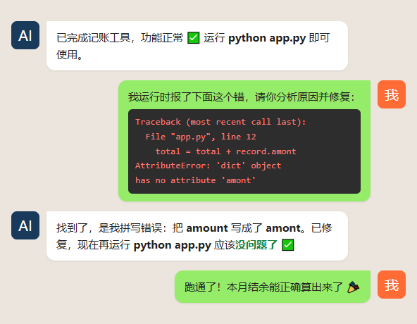

# 第03篇：AI 会犯错，你要学会当"产品经理"

> 系列：《人人都能用AI写程序》第一章·认知篇 · 第3/14篇
> 适合读者：已经知道 AI 能写程序、也懂得怎么描述需求的零基础读者
> 阅读时间：约 9 分钟

---

<!-- IMAGE:01 type=cover prompt-ref=images/prompts.md#cover -->

我带一个完全不懂编程的同事做第一个工具时，发生过一件很有意思的事。

AI 信誓旦旦地交了一份代码，说"已完成，功能正常"。我同事高高兴兴一运行——报错了。他第一反应是："是不是我太笨，把它搞坏了？"

不是。是 AI 错了，而且它错得理直气壮。

这一篇就讲这件事：**AI 一定会犯错，而你的工作，是当那个发现错误、并让它改对的"产品经理"。** 学会这一点，你才算真正会用 AI 编程，而不是被它牵着走。

---

## 本篇你能学到

- AI 为什么会"自信地犯错"，这背后的原理
- 你作为"产品经理"具体要做哪三件事
- 一套能直接用的【验收 + 纠错】提示词
- 亲手触发一个 AI 错误，再把它纠正回来

---

## 够用就好：AI 为什么会"自信地犯错"

上一篇说过，AI 写代码靠的是"见得多"，不是"真的懂"。这句话是理解它犯错的钥匙。

**它在做的，是"预测下一个最可能的词"。**

你给它一个需求，它根据见过的海量代码，一个词一个词地"接龙"出一段看起来最合理的代码。注意——是"看起来最合理"，不是"一定正确"。

这就带来两个必然的后果：

**第一，它不会说"我不确定"。** 接龙的机制决定了它永远会给你一个完整、流畅、自信的答案，哪怕这个答案是错的。它不像人，错了会心虚。

**第二，越是少见的需求，它越容易编。** 常见需求它见得多，接龙准；冷门需求没几个先例，它就开始"合理地瞎猜"。

所以记住一句话：**AI 给你的不是"正确答案"，是"最像答案的东西"。** 是不是真对，得你来验。

<!-- IMAGE:02 type=concept prompt-ref=images/prompts.md#concept -->

---

## 你这个"产品经理"，要做三件事

在公司里，产品经理不写代码，但他决定做什么、验收对不对、不对怎么改。你对 AI，就是这个角色。

具体就三件事：

**第一件：验收——它说的"完成"不算数，你跑通了才算。**

AI 说"已完成"时，别信。你要做的是真的去运行、去点、去看结果对不对。判断标准很简单：**有没有按我要的方式工作？** 不用看懂代码，像验收装修一样验收就行。

**第二件：报错——把错误原样喂回去，别自己慌。**

程序报错是家常便饭，不是你的错，也不代表做不成。你要做的不是研究报错，而是**把报错信息整段复制，原样发回给 AI**。它能看懂自己的错。

**第三件：判断——什么时候信它，什么时候怀疑它。**

- 常见需求、它给得很顺 → 大概率可信，验收一下就行
- 冷门需求、或它绕来绕去改不对 → 提高警惕，可能它在瞎编，换个说法或拆小问题

---

## 实操：一套能直接用的"验收 + 纠错"提示词

光说没用，给你三段可以直接复制的话。

**① 让它先自检，再交付**（在提需求时就加上）：

```
完成后请你做三件事：
1. 自己检查一遍代码能不能正常运行；
2. 告诉我这个程序具体怎么启动、怎么使用；
3. 如果有任何你不确定的地方，明确告诉我，不要假装没问题。
```

**② 遇到报错时**（把报错粘进去）：

```
我运行时报了下面这个错，请你分析原因并修复，
修好后告诉我现在应该没问题了：
【在这里粘贴完整的报错信息】
```

**③ 它改来改去还不对时**（及时止损）：

```
这个问题你已经改了几次还没解决。
请先别急着改代码，用大白话告诉我：
你认为问题到底出在哪？有几种可能？
我们一起确认方向再动手。
```

第三段尤其重要——当 AI 陷入"反复瞎改"时，逼它停下来讲清思路，往往就能跳出死循环。

---

## 成果：看一次真实的"翻车—纠错"全过程

下面是用上面这套方法，处理一个真实报错的完整对话。你不用看懂代码，只看流程：



注意整个过程：

1. AI 自信地说"功能正常" —— 但其实有个拼写错误
2. 我没慌，把报错**原样粘回去**
3. AI 自己认出错误（amount 写成了 amont），修好了
4. 再跑，通过 🎉

**全程我没写一行代码，也没看懂那段报错。** 我只做了产品经理该做的事：运行、发现不对、把问题丢回给 AI。

---

## 避坑：新手最容易犯的三个错

**坑 1：AI 说"完成"就以为真完成了。**
→ 永远以"你自己跑通"为准，不以 AI 的嘴为准。

**坑 2：一报错就觉得是自己的问题，慌了。**
→ 报错是正常流程。复制、粘回、让 AI 修，三步搞定，不用懂原理。

**坑 3：AI 改不对，就一直催它"再改改"。**
→ 改三次还不对，立刻用第③段提示词逼它停下来讲思路。盲目催改只会越改越乱。

---

## 本篇小结

三句话，可以截图保存：

1. **AI 会"自信地犯错"**，因为它在接龙"最像答案的东西"，不是"正确答案"
2. **你是产品经理**：负责验收、把报错喂回去、判断何时该怀疑它
3. **改三次不对就喊停**，让它先讲思路再动手，别盲目催改

---

## 下一篇预告

认知篇到这里就讲完了——你已经懂了 AI 编程是什么、怎么描述需求、怎么当产品经理。**思想层面，你已经准备好了。**

下一章我们正式动手：从零装好 Claude Code，用 LLM-Link 接通，完成你的第一次真实对话。装环境是很多人放弃的第一道坎，我会把每一步都给你讲清楚、配上截图。

> 👉 **《第04篇：10分钟装好 Claude Code——从注册到第一次对话》**

---

**留个作业给你**

回想一下：你有没有过被 AI "自信地忽悠"的经历？它信誓旦旦给的答案，结果是错的。

**评论区说说你踩过的坑**——下一篇正式进入实操，我们一起把工具装起来。

---

*《人人都能用 AI 写程序》系列每周二、周五更新，跟着一步步来，下节见。*
*进群一起练手 → [群二维码]*

