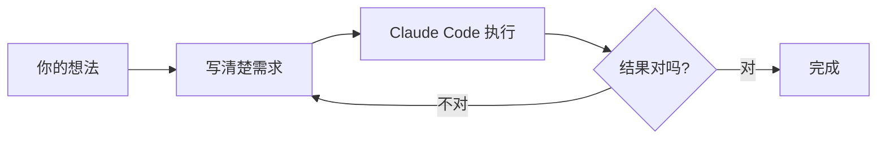
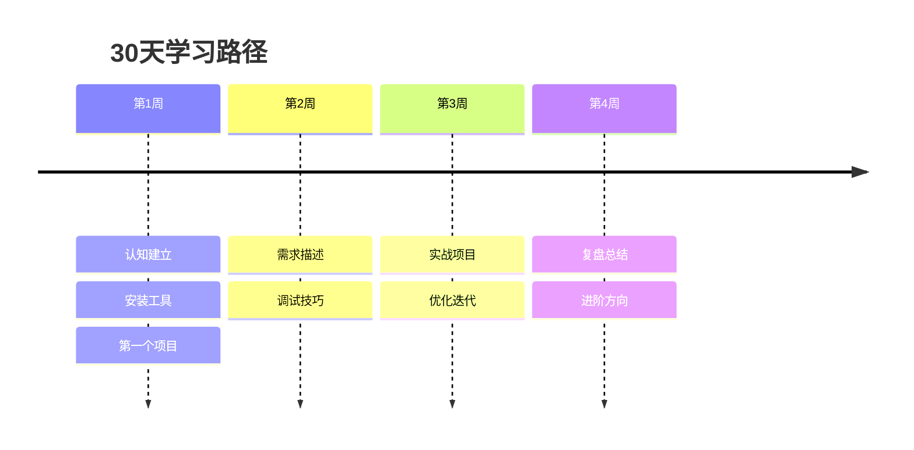
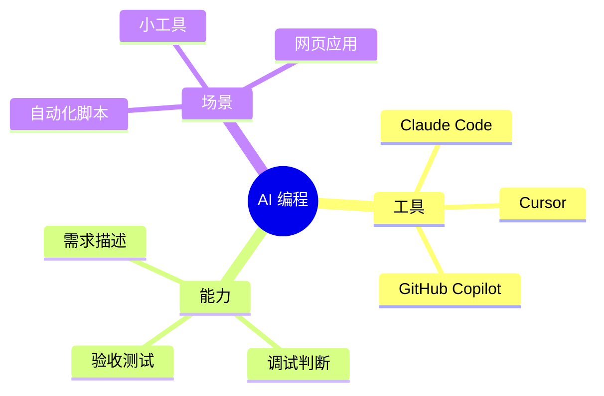
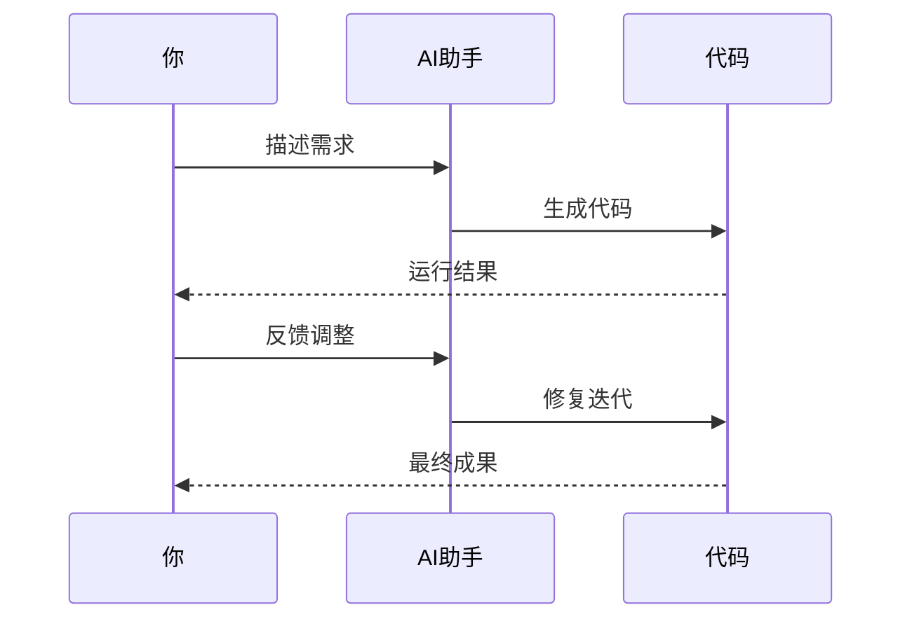
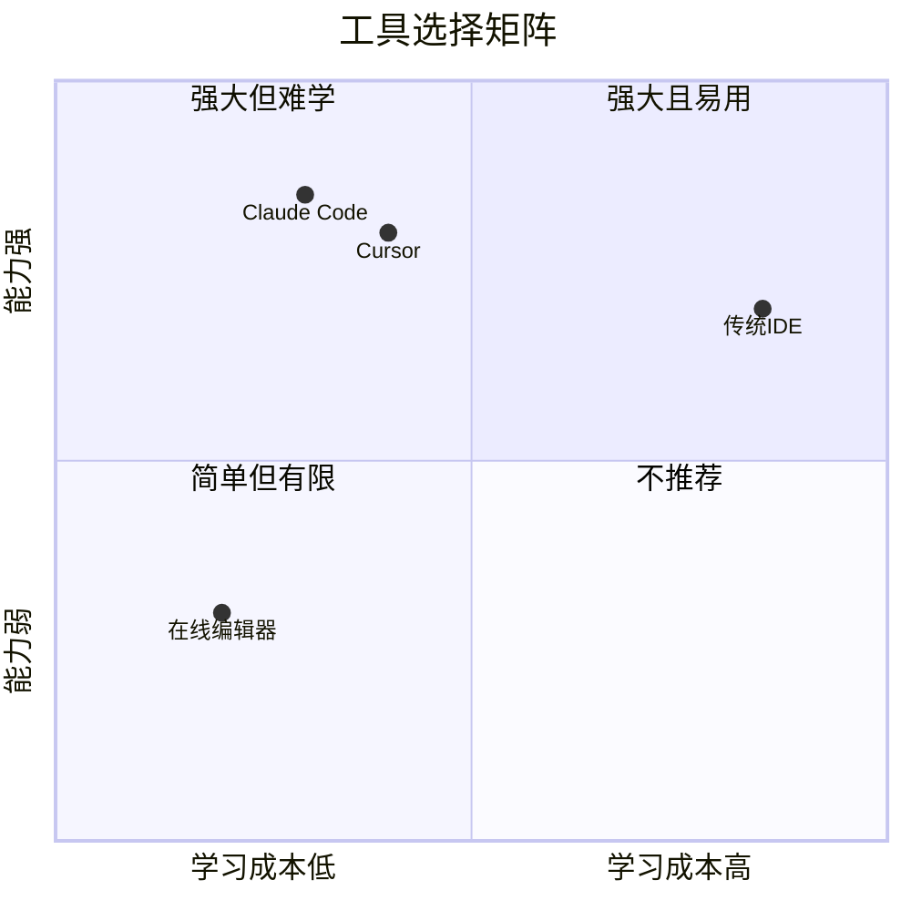

# 文章模板与图片提示词库

> 配套技能：article-writing-pipeline
> 用途：阶段2（大纲）和阶段4（配图）的可直接套用模板
> 维护原则：每加一个模板，必须先在真实文章里验证过

---

## 一、内容类型快速判断

| 类型 | 主要目的 | 占比 | 平台优先 | 用哪类模板 |
|------|---------|------|---------|----------|
| A类干货 | 教读者一项技能/概念 | 50% | 公众号 + 小红书 | A1 教程、A2 概念解析 |
| B类测评 | 帮读者做选择 | 30% | 公众号 + 小红书 | B1 工具对比、B2 实测复盘 |
| C类植入 | 引导读者使用产品 | 20% | 公众号 | C1 省钱攻略、C2 故事植入、C3 操作步骤 |

---

## 二、A类干货模板

### A1：教程类（"如何做X"）

**适用**：教读者一项可立即上手的技能。

**结构骨架**：

```markdown
# 标题：{动词}{结果}的{N}个步骤｜适合{读者画像}

> 副标题区：系列定位 / 阅读时间 / 适合读者

## ① Hook（钩子）
{用一个反差陈述或具体数字开头}
{绝不用"在当今XX时代"}

## ② Context（上下文）
{读者大概率知道什么 → 这篇要解决的具体问题是什么}
{建立"我懂你的痛"}

## ③ Main（主体）

### 第一步：{动词+结果}
- 反模式：很多人会先去做 X → 结果是 Y（坏结果）
- 正确做法：先做 Z → 因为 W（原理）
- 具体操作：{命令/截图描述/步骤}

### 第二步：{动词+结果}
（同上结构）

### 第三步：{动词+结果}
（同上结构）

## ④ Practical（落地）
读完后立刻能做的最小动作：
1. 打开 {具体工具}
2. 输入 {具体内容}
3. 检查 {具体指标}

## ⑤ CTA
{单一行动召唤}
{评论引导问题}
```

**字数参考**：1500-2500字。

**配图建议**：
- 封面图（AI生成）
- 每个步骤一张操作截图或 Mermaid 流程图
- 总流程图一张（Mermaid）

### A2：概念解析（"X是什么"）

**适用**：把一个看似抽象的概念讲到读者能复述。

**结构骨架**：

```markdown
# 标题：{概念名}到底是什么？{反差陈述}

## ① Hook
{用一个数据 + 反常识陈述开头}
例："75%的人在做X时，从来没有Y"

## ② 你以为的X，和现在的X
- 你以为：{常见误解}
- 现在是：{真实情况}

## ③ 一个类比
{把抽象概念映射到读者熟悉的场景}
例：开车去上海 / 装修房子 / 点外卖

## ④ 它能做什么（3个真实案例）
- 案例1：{一句话场景 + 结果}
- 案例2：...
- 案例3：...

## ⑤ 它的边界（必须说清楚）
- 擅长：...
- 不擅长：...
- 容易翻车的地方：...

## ⑥ 三句话总结
1. ...
2. ...
3. ...

## ⑦ CTA
{下一篇预告 + 互动}
```

**字数参考**：1800-2500字。

**配图建议**：
- 封面图（AI生成，体现类比场景）
- 类比对比图（左右两栏，路径B Mermaid 或 Canva）
- 边界说明图（路径B）

---

## 三、B类测评模板

### B1：工具对比（"X vs Y"）

**适用**：读者在多个工具间犹豫，需要决策依据。

**结构骨架**：

```markdown
# 标题：{工具A} vs {工具B}：{某个维度}差距有多大？我用了{时长}得出这个结论

## ① Hook
{用具体的实测数据/金额/时间开头}

## ② 我为什么测这个
{读者的真实困扰 → 我的测试动机}

## ③ 测试方法
- 测试场景：{一句话}
- 测试时长：{N天 / N次任务}
- 评分维度：{3-5个}

## ④ 维度1：{维度名}
- {工具A}的表现：...
- {工具B}的表现：...
- 谁赢：...

## ⑤ 维度2：{维度名}
（同上）

## ⑥ 维度3：{维度名}
（同上）

## ⑦ 总分对比表
| 维度 | A | B |
|------|---|---|
| ... | ... | ... |

## ⑧ 结论：什么场景选谁
- 如果你是{画像1} → 选A，因为{理由}
- 如果你是{画像2} → 选B，因为{理由}
- 如果你是{画像3} → 都不选，去看{第三选项}

## ⑨ CTA
{评论你的选择 + 互动}
```

**字数参考**：2000-3000字。

**配图建议**：
- 封面图（两个工具图标对决）
- 总分对比表（路径C，Canva 卡片）
- 关键场景截图

### B2：实测复盘（"我用X做了Y"）

**适用**：用具体项目做载体，展示工具/方法的真实表现。

**结构骨架**：

```markdown
# 标题：我用{工具}花了{时长}做了{产出}，结论是{反差结论}

## ① Hook
{产出的真实成果数据}

## ② 起点：我的需求
{真实需求描述，避免编造}

## ③ 过程：5个关键时刻
### 时刻1：{踩坑/转折}
### 时刻2：...
### 时刻3：...
### 时刻4：...
### 时刻5：...

## ④ 结果对比
- 投入：{时间/金钱}
- 产出：{具体成果}
- 如果不用这个工具会怎样：...

## ⑤ 给同行的3条建议
1. ...
2. ...
3. ...

## ⑥ CTA
{资源放出 + 互动}
```

**字数参考**：2000-3500字。

**配图建议**：
- 封面图（产出成果的视觉化）
- 时间线图（Mermaid）
- 关键截图 3-5 张

---

## 四、C类植入模板

### C1：省钱攻略

**适用**：在干货中自然带出产品价值。

**结构骨架**：

```markdown
# 标题：{某场景}里，我把成本从{原价}降到{新价}的方法

## ① Hook
{真实金额对比，越具体越好}

## ② 大多数人怎么花的（不点名）
- 方式A：花费 {金额} → 痛点
- 方式B：花费 {金额} → 痛点

## ③ 我的省钱思路（3个原则）
1. ...
2. ...
3. ...

## ④ 具体怎么操作
{步骤化说明，自然带出工具}

## ⑤ 真实账单对比
| 项目 | 原方案 | 现方案 |
|------|--------|--------|
| ... | ... | ... |

## ⑥ 注意事项
{合规/边界/风险，体现专业}

## ⑦ CTA
{私信/评论领取教程}
```

**字数参考**：1500-2500字。

**配图建议**：
- 封面图（金额对比视觉）
- 账单对比表（路径C Canva）
- 操作步骤截图

### C2：故事植入

**适用**：通过他人故事让产品价值自然浮现。

**结构骨架**：

```markdown
# 标题：{身份}的{故事化主题}：{反差结论}

## ① Hook
{用具体的人物 + 时间 + 场景开头}

## ② 起点：他/她遇到了什么
{画像 + 痛点，越细节越好}

## ③ 转折：他/她做了什么
{动作 + 选择}

## ④ 结果：现在怎样了
{量化成果}

## ⑤ 提炼：3个共性启示
1. ...
2. ...
3. ...

## ⑥ CTA
{评论你的故事 + 资源引导}
```

**字数参考**：1500-2200字。

### C3：操作步骤（高转化）

**适用**：直接教读者用产品完成某事，对完成度高的读者很有效。

**结构骨架**：

```markdown
# 标题：{N}步用{产品}完成{目标}

## ① 你需要准备什么
- ...
- ...

## ② 第一步：{动作}
{截图 + 文字}

## ③ 第二步：{动作}
（同上）

...

## ④ 完成后你会得到什么
{成果展示}

## ⑤ 常见问题3个
- Q：... A：...
- Q：... A：...
- Q：... A：...

## ⑥ CTA
{私信/评论 + 进群}
```

**字数参考**：1000-1800字（这类越短越好）。

---

## 五、图片提示词模板库

> 所有 AI 生成图都通过 LLM-Link 调用 gpt-image-2，提示词留底在 `articles/<slug>/images/prompts.md`。
>
> **分层视觉策略**（实测沉淀）：
> - **封面图**：**专业科技/科幻/商务风**（深蓝科技底 + 数据流/神经网络/光效，人物用几何剪影或抽象全息，绝不卡通萌系）。用 gpt-image-2 生成。要有高端科技发布会主视觉/深度科技报道封面的质感。**每篇封面要有差异**——换主色调、换核心视觉隐喻，避免全系列雷同。
> - **原理/架构图**：黑白手绘信息图风（铅笔/钢笔线稿质感）。这是讲透概念的精髓——**图里要有真实的文字标注和技术名词**，信息密度高，像专业讲义里的板书图解（如"寄快递"讲三层架构、冰山图讲需求、选择矩阵）。不是气氛插画，是"用来讲明白知识的信息图"。
> - **对比/演示图**：用 HTML+JS 做动态对比 GIF（如"模糊需求 vs 清晰需求"双路对话同屏），左右红绿对照，代入感和说服力最强。
> - **成果/操作图**：用 CloakBrowser 截真实运行结果或终端，绝不用 AI 编。
>
> 关键教训：
> 1. AI 生成的图**渲染中文文字会乱**。带中文的信息图/矩阵/对比，一律用 HTML 精确绘制 + CloakBrowser 截图（见 cloakbrowser-scraper 技能的 templates/），不让 gpt-image-2 写中文。
> 2. 封面**早期试过卡通萌系，被否**——目标读者是想做事的成年人，要专业科技感才有信任度和高级感。

### 5.1 提示词6要素

```
[图表类型] + [读者应该得到什么结论] +
[布局/元素] + [视觉风格] + [配色] + [输出要求]
```

### 5.2 封面图提示词（横版 1536x1024）

**通用模板**：

```
专业科技风格的杂志封面插画，横版 16:9，深邃高级感。

主题：{文章核心主题，一句话}

画面构成：
- 主体区（左/中 2/3）：{用科技元素表达主题的核心隐喻——数据流、神经网络节点、光束、几何全息体、剪影人物等}
- 人物（如需）：干净的几何剪影，绝不画卡通脸/真实人脸
- 右侧 1/3：深色留白区，用于后期叠加文字标题

视觉风格：科技感、科幻感、商务专业感；像高端科技发布会主视觉 / 深度科技报道封面 / 数据可视化艺术的质感；干净、克制、有未来感。

配色：以深蓝（#0a1428 到 #1a3a5c 渐变）为基底；{本篇主色调——每篇换一种以示区分，如青绿#1fc8a0、紫#7c5cff、暖金等}；橙色 #ff6b35 作点睛高光。

光影：暗背景 + 发光元素，有层次和纵深。

不要出现：
- 任何中文或英文文字
- 卡通可爱 Q 版萌系、圆润萌系
- 真实人脸特写
- 杂乱背景、过度装饰、低龄化元素

输出：PNG，高清，16:9 横版。
```

> **差异化要求**：每篇封面换「主色调 + 核心视觉隐喻」，保证全系列统一风格但各有主视觉，不雷同。

**主题特化样例（视觉隐喻 + 主色调，已验证）**：

| 文章主题 | 核心视觉隐喻 | 主色调 |
|---------|------------|--------|
| 01 AI编程是什么 | 剪影人物 + 发光笔电 + 全息AI协作 + 数据粒子 | 科技蓝 |
| 02 需求描述 | 左混沌碎片 → 中间光束漏斗收敛 → 右有序数据线 | 青绿 #1fc8a0 |
| 03 当产品经理 | 人形剪影"指挥"光流，AI执行体有对错分流光路 | 可用紫/琥珀 |
| 工具对比 | 两束不同色光流对峙，中间天平/评分光柱 | 双色对比 |
| 省钱攻略 | 成本曲线下行光带 + 数据仪表盘 | 冷蓝+金 |
| 学习路径 | 上升的光阶/路径网络 + 终点光点 | 渐变蓝紫 |

### 5.3 概念说明图提示词（方版 1024x1024）

```
简洁的信息图表，方形构图。

要表达的核心观点：{一句话说清图要传达什么}

图表类型：{流程图 / 对比图 / 关系图 / 层级图}

必须包含的元素：
1. {元素1}
2. {元素2}
3. {元素3}

元素之间的关系：{用箭头/颜色/位置区分}

视觉布局：
- 中心或主轴：...
- 次要元素分布：...

风格要求：
- 白色或浅灰背景
- 节点用圆角矩形
- 线条清晰，关系明确
- 关键词加粗

配色：
- 主色：深蓝 #1a3a5c
- 强调：橙色 #ff6b35
- 次要：浅灰 #e0e0e0

不要：3D 效果、阴影、过度装饰、密集小文字。

输出：PNG，高清。
```

### 5.4 场景插画提示词（用于故事类文章）

```
温暖扁平插画风格，方形或横版构图。

场景：{具体场景描述，1-2 句}
人物：剪影或卡通化处理，不画清晰五官
人物动作：{具体动作}
人物表情倾向：{放松 / 专注 / 困惑 / 喜悦}

环境：
- 主体物：{1-2 个}
- 背景：{简化处理}

光线：自然光，明亮但不刺眼

配色：与品牌色一致（深蓝 + 橙色 + 白）

不要：真实人脸、复杂背景、密集文字、夸张表情。
```

### 5.5 数据可视化提示词

数据类图建议优先用 Markdown 表格或 Mermaid，AI 生成的数据图易出错。如果一定要 AI 生成：

```
极简数据图，方形构图。

数据类型：{条形图 / 饼图 / 折线图}

要展示的数据：
- 类目1：{数值}
- 类目2：{数值}
- 类目3：{数值}

关键结论：{一句话标注在图上}

风格：
- 白色背景
- 横向条形图，最长条用橙色高亮
- 其他条用深蓝
- 数值标注在条形末端

不要：3D、网格线密集、多余装饰、立体效果。
```

---

## 六、Mermaid 图典型范例

> Mermaid 直接嵌入 Markdown，公众号发布时用 `mmdc` 工具转 PNG。

### 6.1 流程图（最常用）



**适用**：教程类的步骤说明、决策流程。

### 6.2 时间线（系列教程进度）



### 6.3 思维导图（概念分类）



### 6.4 时序图（多角色协作）



### 6.5 对比矩阵（2×2）



---

## 七、跨平台改编对照表

| 元素 | 公众号 | 小红书 | 抖音 |
|------|-------|--------|------|
| 标题字数 | 15-25 | 18-28 + emoji | 20-30，前3字必须钩子 |
| 全文字数 | 1500-3000 | 800-1200 | 200-300（口播稿） |
| 段落长度 | 3-5 句 | 1-3 句 | 1-2 句 |
| 配图比例 | 16:9 横版 | 3:4 或 1:1 | 9:16 竖版 |
| 配图数量 | 3-5 张 | 6-9 张（卡片化） | 不需要静态图 |
| 互动话术 | 留言区/在看 | 收藏/关注/评论 | 关注/点赞/评论 |
| 标签 | 不用 hashtag | 5-10 个 | 3-5 个 + 话题 |
| 转发触发 | 干货价值 | 颜值 + 干货 | 反转 + 情绪 |

---

## 八、质量检查清单

### 大纲阶段
- [ ] 每个小标题能用一句话回答"读者读完带走什么"
- [ ] 5 段式结构齐全
- [ ] 至少 5 张事实卡片有归属
- [ ] 每张图都有占位且决策树过关

### 写作阶段
- [ ] 第一段没有"在当今XX时代"
- [ ] 每段不超过 3 句话
- [ ] 类比落地（举具体角色而非抽象概念）
- [ ] 反模式在前，正确做法在后
- [ ] 数据都有出处或来自研究卡片
- [ ] 删干净"非常/极其/十分"
- [ ] 结尾是单一行动，不是总结

### 配图阶段
- [ ] 每张图都是"压缩工具"而非装饰
- [ ] AI 图未生成中文标题文字
- [ ] 配色与品牌色一致
- [ ] 没有真实人脸
- [ ] Mermaid 公众号发布前已转 PNG

### 改编阶段
- [ ] 小红书版本前 1 句能让人停下来
- [ ] 抖音口播稿 60-90 秒读完
- [ ] 每个平台版本都做了"第三方读者"自检


